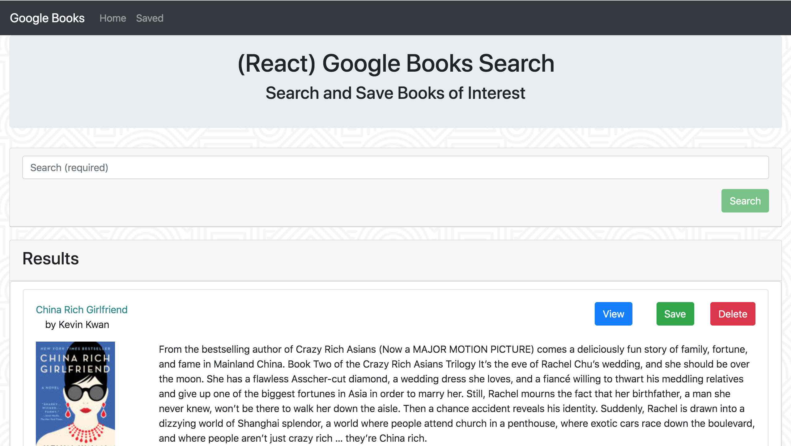

## Google Books

React-based Google Books Search app. It is made with React components, helper/util functions, and utilize React lifecycle methods to query and display books based on user searches. It uses Node, Express and MongoDB so that users can save books to review or purchase later.

# Pages in the App

  * Search/Home page - User can search for books via the Google Books API and render them here. User has the option to "View" a book, bringing them to the book on Google Books, or "Save" a book, saving it to the Mongo database or "Delete" to delete from the database.

  * Saved page - Renders all books saved to the Mongo database. User has an option to "View" the book, bringing them to the book on Google Books, or "Delete" a book, removing it from the "Saved" page. Removing a book from "Saved" page will return it to the Home or Search page.

- - -

The project is useful because it provides an example of languages/technologies I learned and show what I can do as a developer. This application Node.js with Express and React, MongoDB, Bootstrap, HTML, and CSS that is deployed in Heroku.

For questions or concerns, please go to my website at https://caracrotty.herokuapp.com or send an email at admin@carafelise.com. I maintain and developed this project.